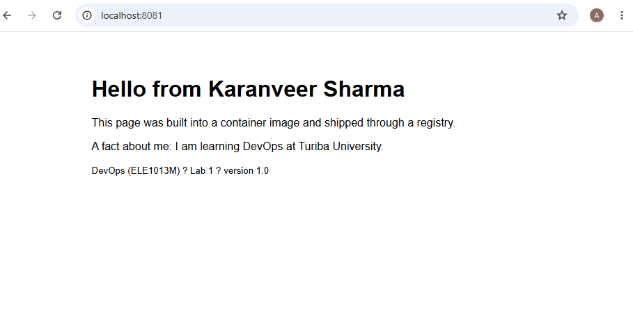

# Lab 1 · Ship it

- **Image:** `ghcr.io/ankitamandlik5-web/lab1-web:1.0`
- **Digest:** `sha256:8161f9b85d966a2af803532e045c3c9b29b6034c03008cb16c4661988a6144d`
- **Platforms:** linux/amd64, linux/arm64
- **Partner's image I ran:** `ghcr.io/ikaran34/lab1-web:1.0`
- **Digest matched:** yes

## Answers

### 1. Where does the kernel used by your containers come from on your laptop?

I am using Windows with WSL 2. Docker Desktop uses the Linux kernel provided by WSL 2.

My `uname -r` output was:

`6.18.33.2-microsoft-standard-WSL2`

Both Ubuntu and Alpine containers used the same WSL 2 kernel.

### 2. What is the difference between `lab1-web:1.0` and `mypage`?

`lab1-web:1.0` is a Docker image. It contains nginx and my HTML page.

`mypage` is a container created from that image. The image is the template, while the container is a running instance of that image.

### 3. In Part 2 your edit to `index.html` survived `docker stop` but not `docker rm`. Why?

The edit was stored in the container's writable layer. `docker stop` only stops the container, so the writable layer remains.

`docker rm` removes the container and its writable layer, so the edit is lost. The original Docker image was not changed.

### 4. Your page is about 1 KB, the image is tens of MB. What do you think the rest is?

Most of the image size comes from the nginx base image and its layers. This includes Alpine Linux, nginx, configuration files, libraries and other files needed to run the web server. My HTML file is only a small part of the image.

